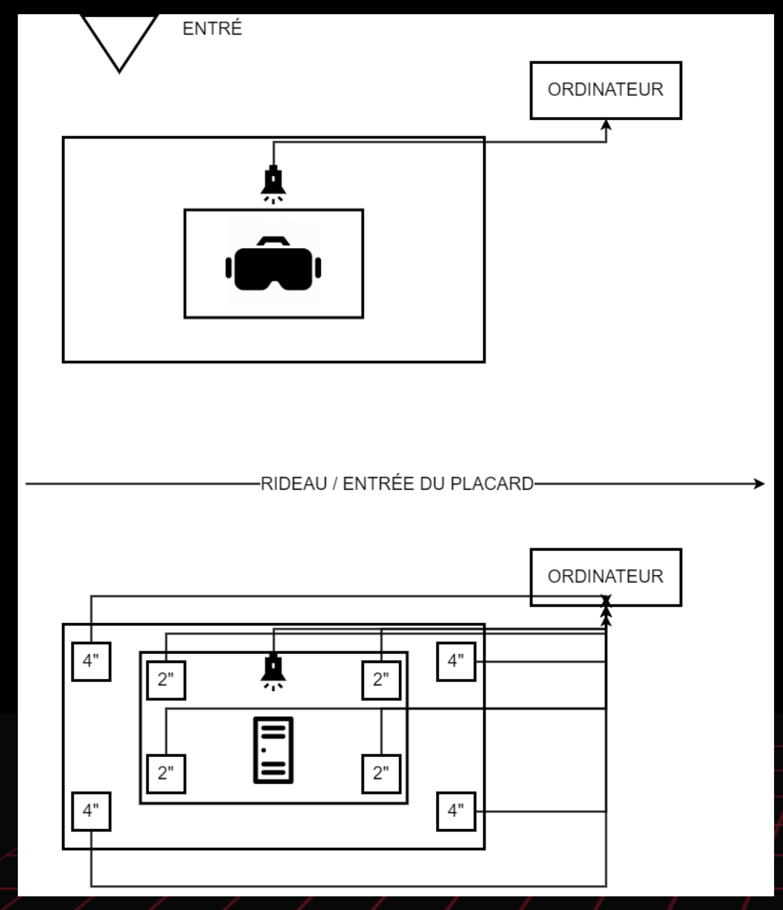

# Titre :

3 minutes

# Les créateurs :

- Naoufal Bensaiad
- Jérémie Lévesque
- Samuel Poulin

# La façon dont le thème du temps est exploité dans la création :

Le temps de l'expérience est déjà déterminé 3 minutes de lancer des ballons des adversaires et 3 minutes renfermer dans un casier. Les deux expériences étant dans
la même œuvre, mais donnent un impression du temps différente, le lancer de ballon est rapide à cause du plaisir que sa apporte et l'expérience du casier apporte du
Stress et de l'inconfort, donc dure plus longtemps mentalement. L’œuvre donne donc de différant perception du temps.

# L'ambiance :

- La premier partie : Joyeuse, active et réussite.

- La deuxième partie : Triste, stress et isolement.

# L'installation en cours dans les studios :

(image du casier où se déroule la 2e partie de l'oeuvre)

(image de l'installation de l'oeuvre)

source site web TIM : (https://tim-montmorency.com/2022/projets/3-minutes/docs/web/preproduction.html)

# Le schéma de l'installation prévue :

(image de l'installation de l'oeuvre)

source site web TIM : (https://tim-montmorency.com/2022/projets/3-minutes/docs/web/preproduction.html)

# Ce qui est attendu de l'interacteur.trice :

Durant l'expérience, il faut ressentir une sorte de réussite lors de la première partie avec le casque VR et jouer au jeu de lancer les ballons sur les cibles, et aller dans un casier par la suite de la première partie, être isolé et entendre des bruits dérangeants, donc ressentir du stress et de la tristesse. Ressentir la différence entre les deux expériences donner dans le même nombre de temps.

# 3 cours du programme qui vous semblent incontournables pour avoir les compétences pour créer ce projet

- Réalité virtuelle :
Pour faire l'expérience en VR il faut savoir s'en servir donc avoir fait ce cours.

- Animation 3D :
Pour faire des modèles 3D à mettre dans le jeu (l'expérience) VR.

- Conception sonore interactive :
Pour ajouter du son dans le jeu (l'expérience) VR pour la rendre plus interactive.

# Sources :

- site web du projet : https://tim-montmorency.com/2022/projets/3-minutes/docs/web/index.html
- vidéos qui présente le projet : https://www.youtube.com/watch?v=0JszUkVBhQc&ab_channel=JérémieLévesque
- suite site web du projet : https://tim-montmorency.com/2022/projets/3-minutes/docs/web/preproduction.html
- Github du projet : https://github.com/tim-montmorency/66B-modele_de_projet
