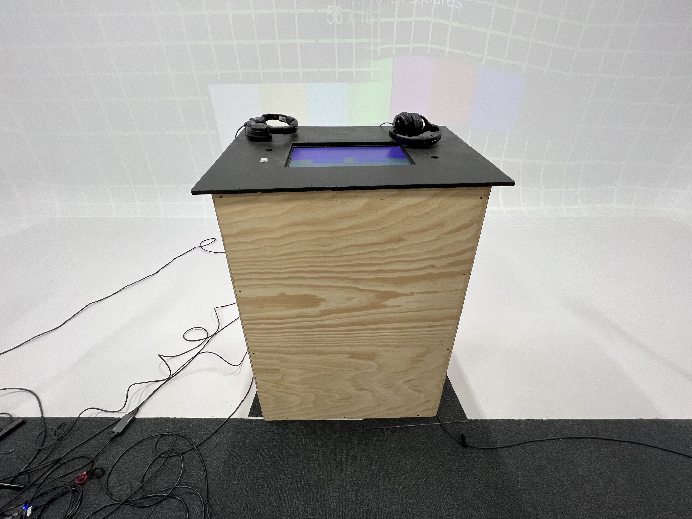
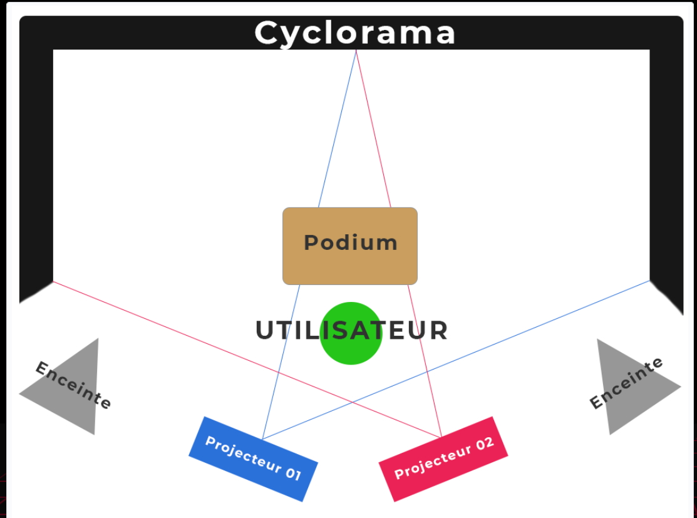

# Titre :

Jeu Temporel

# Les créateurs :

- Raphaël Fillion
- Philippe Trudel

# La façon dont le thème du temps est exploité dans la création :

Le temps?

# L'ambiance :

L'ambiance va changer au fil de l'experience 

# L'installation en cours dans les studios :

# Le schéma de l'installation prévue :

# Ce qui est ettendu de l'interacteurs.trise :

# 3 cours du programme qui vous semblent incontournables pour avoir les compétences pour créer ce projet

