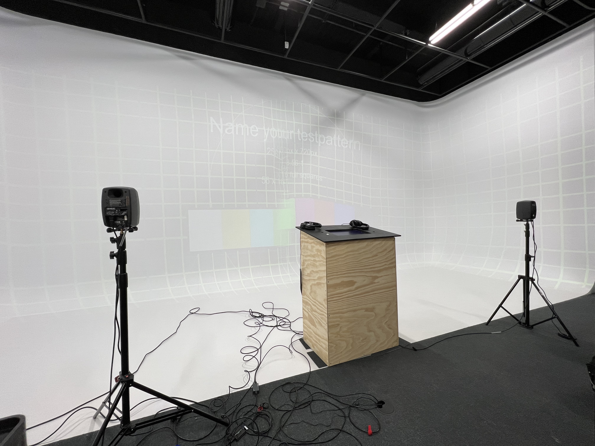

# Titre :

Jeu Temporel

# Les créateurs :

- Raphaël Fillion
- Philippe Trudel

# La façon dont le thème du temps est exploité dans la création :

Le temps?

# L'ambiance :

L'ambiance va changer au fil de l'experience 

# L'installation en cours dans les studios :

source des images : (https://tim-montmorency.com/2022/projets/Jeu-Temporel/docs/web/index.html)

# Le schéma de l'installation prévue :

source de l'image : (https://tim-montmorency.com/2022/projets/Jeu-Temporel/docs/web/preproduction.html)

# Ce qui est ettendu de l'interacteur.trise :

Il est attendu de l'interacteurs qu'il réponde aux questions demander dans le questionnaire donner par l'animateur de l'expérience et porter attention aux réactions de l'animateur par rapport au réponse donnée par l'interacteur. On peut voir les questions avec le podium ou un écran tactile est poser pour choisir une réponse au choix de réponse. Voire la réaction de l'animateur avec les projecteurs qui le projet sur les murs.

# 3 cours du programme qui vous semblent incontournables pour avoir les compétences pour créer ce projet

