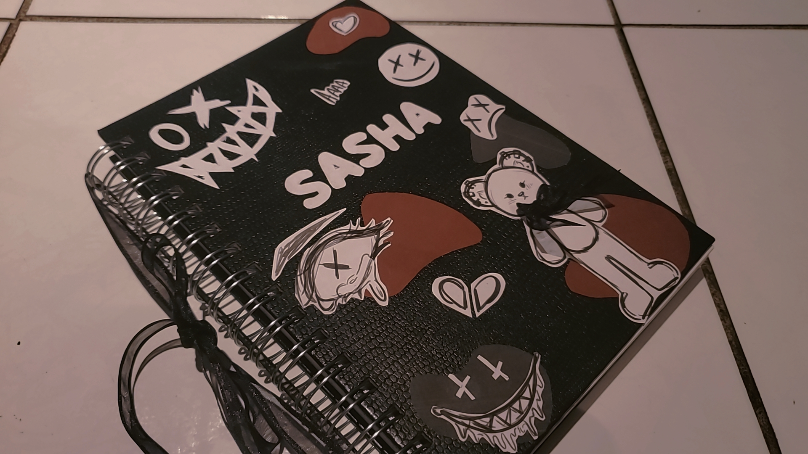
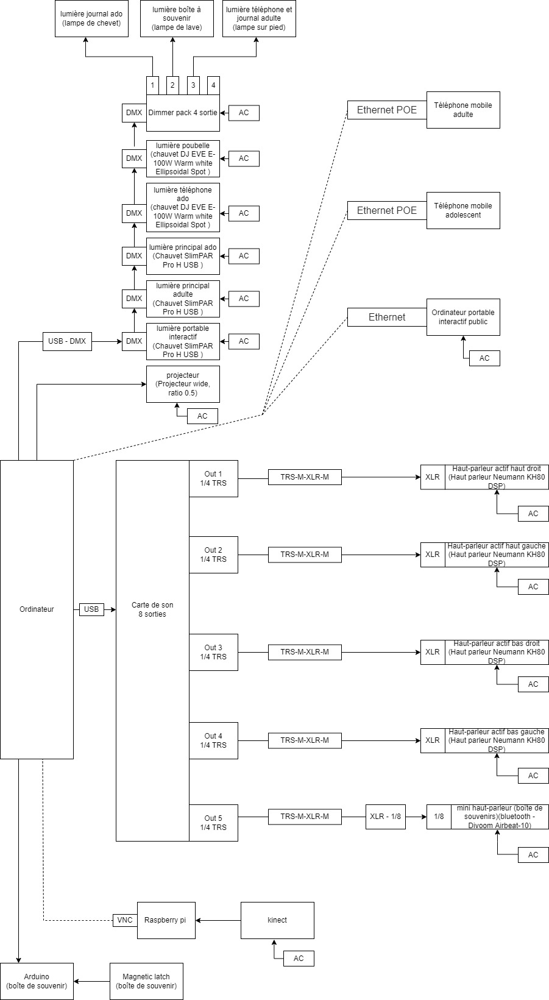

# le titre

Chère Sasha

# les créateurs et créatrices

-Trish Nguyen

-Angelina De Silva Jeca

-Karine Cormier

-Sabrina Kayani

# la façon dont le thème du temps est exploité dans la création

# l'ambiance

Lors de la première partie, nous serons dans une petite chambre sale.

Lors de la deuxieme partie, nous serons dans une chambre beaucoup plus propre et ordonnée.

# l'installation en cours dans les studios 

# le schéma de l'installation prévue 

# ce qui sera attendu de vous, en tant qu'interacteur

Nous devons apprendre à connaitre Sasha. Il faut bien écouter les messages vocaux, les notes, analyser la chambre de Sasha et comprendre le but de ses actions.

# 3 cours du programme qui vous semblent incontournables pour avoir les compétences pour créer ce projet

Conception sonore pour faire les musiques et l'ambiance.

Intégration web pour pouvoir programmer l'interface

Conception vidéo pour faire les vidéos et les montages.

# source

https://tim-montmorency.com/2022/projets/Chere-Sasha/docs/web/index.html

https://www.youtube.com/watch?v=NmPHAYGlMG4&feature=youtu.be

https://github.com/task-tim/Chere-Sasha

https://tim-montmorency.com/2022/projets/Chere-Sasha/docs/web/preproduction.html
