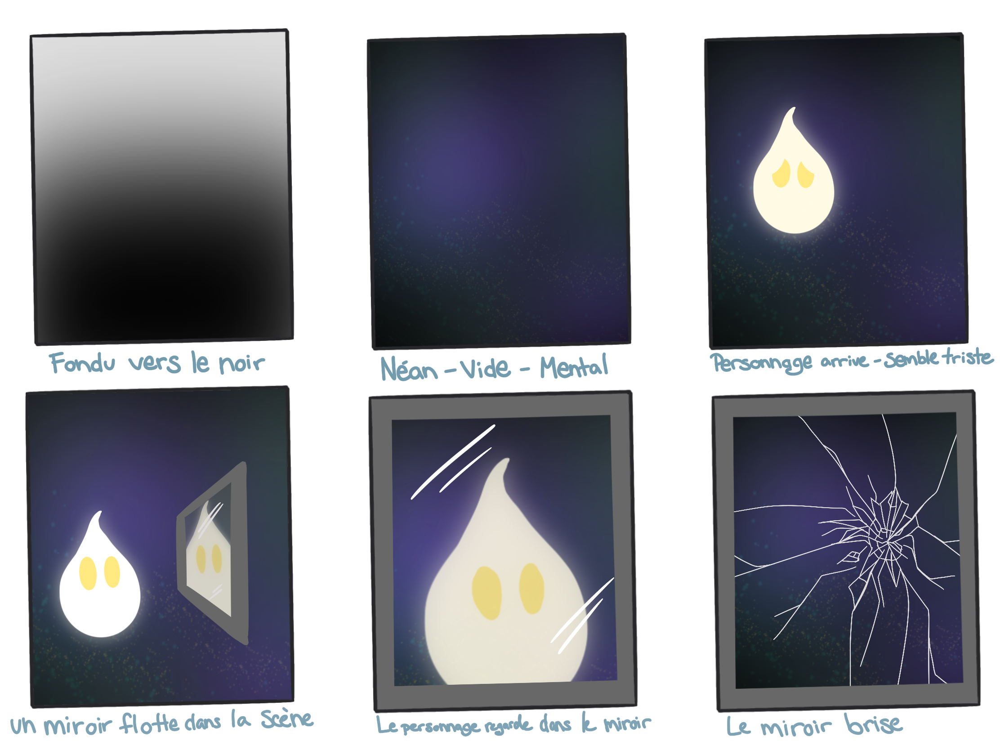

# le titre

chronaufrage

# les créateurs et créatrices

-Maloney Khim

-Sounthida Kong

-Olivier Lalonde

-Rebecca Pilotte

-Émilie Fontaine

# la façon dont le thème du temps est exploité dans la création

# l'ambiance

lambiance serait calme parce qu'ils ont essayer de reproduire un musé. Il va y avoir 4 grand arts.

# l'installation en cours dans les studios 

# le schéma de l'installation prévue 

# ce qui sera attendu de vous, en tant qu'interacteur

Nous devons regarder les arts et faires des mouvement gestuelle pour animer les ouevres.

# 3 cours du programme qui vous semblent incontournables pour avoir les compétences pour créer ce projet

Animation 2D pour faire les personnages et les animer.

Conception sonore pour faire la musique.

Montage vidéo pour pouvoir mettre en monter le projet.

# source

https://tim-montmorency.com/2022/projets/Chronaufrage/docs/web/index.html

https://www.youtube.com/watch?v=SATIxHCn6SI

https://github.com/Blobduckies/Chronaufrage

