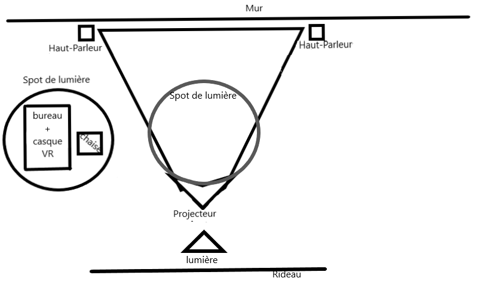

# le titre

distorsion collective

# les créateurs et créatrices

-William Dubois

-Ghislain Lacombe

# la façon dont le thème du temps est exploité dans la création

# l'ambiance

L'histoire va se dérouler à l'intérieur d'une maison en réalité virtuelle. La maison aura 3 pièces, la chambre, le salon et la cuisine.

# l'installation en cours dans les studios 

# le schéma de l'installation prévue 

# ce qui sera attendu de vous, en tant qu'interacteur

Nous devons essayer de vivre comme des étudiants qui étudient à distance,mettre le casque Vr et explorer la pièce.

# 3 cours du programme qui vous semblent incontournables pour avoir les compétences pour créer ce projet

Modélisation 3D pour faire les objets 3D.

Realité virtuelle pour créer un environnement immersif.

Intégration web pour programmer l'interface du projet.

# source

https://tim-montmorency.com/2022/projets/Distorsion-collective/docs/web/index.html

https://tim-montmorency.com/2022/projets/Distorsion-collective/docs/web/preproduction.html

https://github.com/Freakout-Programs/Distorsion-collective/
