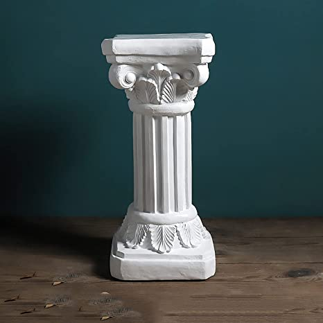
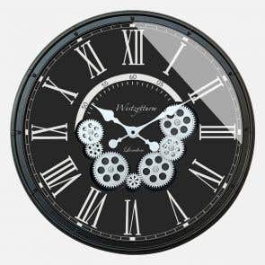
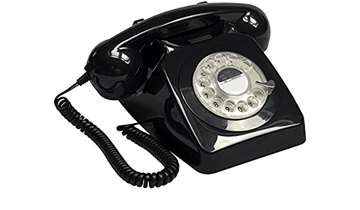
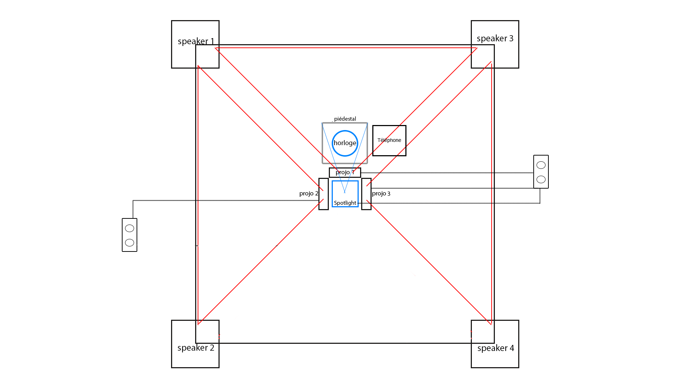

# Titre
L'horloge de l'apocalypse

# Les créateurs et créatrices

-Maxime Sabourin

-Louis Philippe Gravel

-Alexis Lacasse

-Tristan Girard-Montpetit

-Maxime De Falco

# La façon dont le thème du temps est exploité dans la création
Dans cette oeuvre, il y a une horloge qui réagit quand on fait tourner les aiguilles à certaines heures. Plus l'aiguille se rapproche de la fin, plus en plus la scène avance dans le temps et se modernise et devient une apocalypse à la fin.

# L'ambiance

# L'installation en cours dans les studios 

# Le schéma de l'installation prévue 

# Le qui sera attendu de vous, en tant qu'interacteur

# 3 cours du programme qui vous semblent incontournables pour avoir les compétences pour créer ce projet

conception sonores pour mettre la musique

espace interactif pour pouvoir mettre la projection au mur

animation 2D pour faire les dessins de l'environnement

# Source

https://tim-montmorency.com/2022/projets/L-horloge-de-l-apocalypse/docs/web/index.html

https://www.youtube.com/watch?v=Ly4eBT3RRIA

https://tim-montmorency.com/2022/projets/L-horloge-de-l-apocalypse/docs/web/preproduction.html

https://github.com/MALT5/L-horloge-de-l-apocalypse
