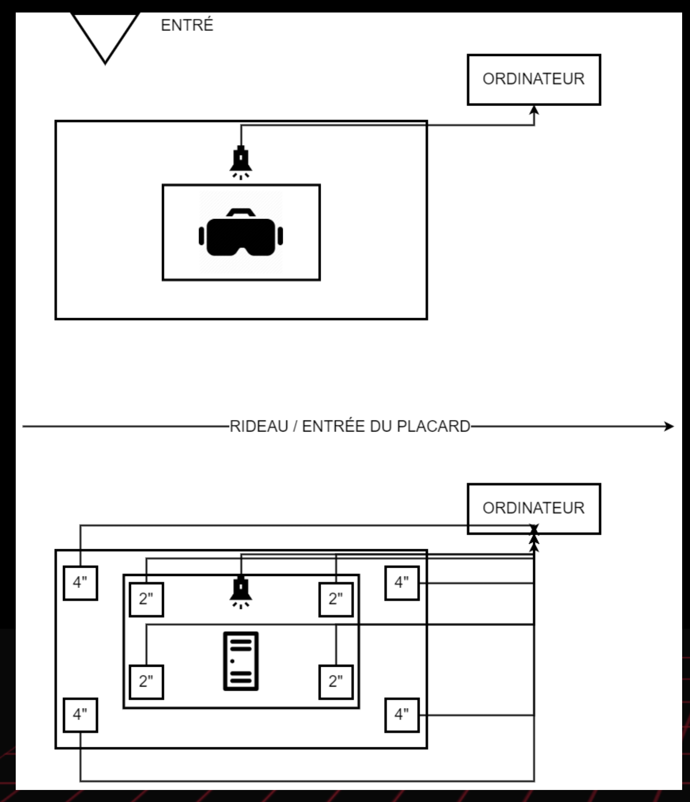

# Titre :

3 minutes

# Les créateurs :

- Naoufal Bensaiad
- Jérémie Lévesque
- Samuel Poulin

# La façon dont le thème du temps est exploité dans la création :

Le temps de l'expérience est déjà déterminé 3 minutes de lacer des ballons des adversaires et 3 minutes renfermer dans un cassier. Les deux expériences étant dans
la même œuvre, mais donnant un impression du temps différente, le lancer de ballon est rapide à cause du plaisir que sa apporte et l'expérience du casier apporte du
Stress et de l'inconfort, donc dure plus longtemps mentalement. L’œuvre donne donc de différant perception du temps.

# L'ambiance :

# L'installation en cours dans les studios :
(photos à l'appui)

# Le schéma de l'installation prévue :
(insérer le schéma de plantation, avec la source)

source site web TIM : (https://tim-montmorency.com/2022/projets/3-minutes/docs/web/preproduction.html)

# Ce qui est ettendu de l'interacteurs.trise :

Durant l'expérience il faut ressentir une sorte de réussite los de la première partie avec le casque VR et jouer au jeu de lancer les ballons sur les cibles, et aller dans un cassier par la suite de la première partie, être isoler et entendre des bruits dérangent, donc ressentir du stress et de la tristesse. Ressentir la différence entre les deux expériences donner dans le même nombre de temps.

# 3 cours du programme qui vous semblent incontournables pour avoir les compétences pour créer ce projet

